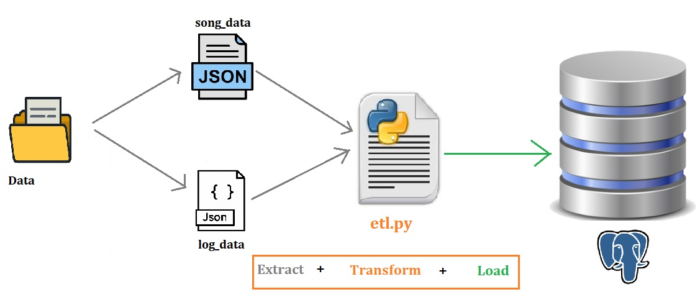
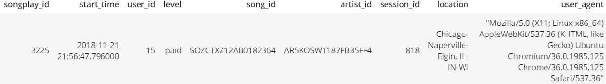
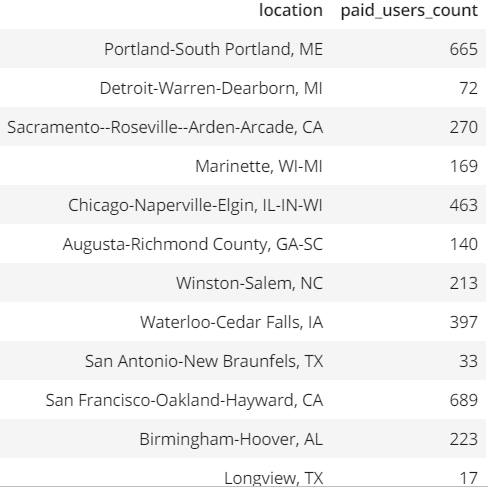

## Data Modeling with Postgres and Building ETL pipeline for anaylising data for a Music Streaming App 

Metadata of the songs and the user activity logs on the music app are stored in a directory of JSON files. This data is modeled for analysing and unserstanding what songs users are listening to. Like *most frequently played songs by the users, top Songs played on particular month/year, which artist songs are most played* etc. So, the focus is mainly on songs played by the users.

- Database used is **Posetgres**
- ETL is done by python sctipt

### Datasets
Metadata of the songs contains the details of both song and its artist, this data is stored in two diffeternt tables ***"songs"*** and ***"artists"*** tables respectively. The metadata files are partitioned by the first three letters of each song's track ID. 

##### songs metadata file paths and JSON sample:

file path: 
```rust,ignore
 data/song_data/A/B/C/TRABCEI128F424C983.json
```

sample JSON: TRABCEI128F424C983.json
```json
{"num_songs": 1, "artist_id": "ARJIE2Y1187B994AB7", "artist_latitude": null, "artist_longitude": null, "artist_location": "", "artist_name": "Line Renaud", "song_id": "SOUPIRU12A6D4FA1E1", "title": "Der Kleine Dompfaff", "duration": 152.92036, "year": 0} 
```

User activity logs contains the details of user, timestamp and session details which are stored in ***"users"***, ***"time"*** and  ***songplays*** tables respectively. The log files in the dataset are partitioned by year and month. For example, here are filepaths to two files in this dataset.

```rust,ignore
data/log_data/2018/11/2018-11-12-events.json
data/log_data/2018/11/2018-11-13-events.json
```

##### Log Dataset JSON sample lines:

```json
{"artist":null,"auth":"Logged In","firstName":"Walter","gender":"M","itemInSession":0,"lastName":"Frye","length":null,"level":"free","location":"San Francisco-Oakland-Hayward, CA","method":"GET","page":"Home","registration":1540919166796.0,"sessionId":38,"song":null,"status":200,"ts":1541105830796,"userAgent":"\"Mozilla\/5.0 (Macintosh; Intel Mac OS X 10_9_4) AppleWebKit\/537.36 (KHTML, like Gecko) Chrome\/36.0.1985.143 Safari\/537.36\"","userId":"39"} 
```

### Tables in the Schema

All the data is loaded into 5 different tables.

1. songplays
2. songs
3. artists
4. users
5. time

### Schema - ***sparkifydb***
Star schema is used to represent the ***"sparkifydb"***.

- songplays is the Fact table of the star schema.
- songs, artists, users and time are the dimension tables.

### ER diagram of sparkifydb


### ETL processing

ETL processing is done using the python code, in which all JSON files in Songs data and log data are processed and loaded into respective tables one by one.



- **songs** and **atrists** dimension tables are loaded from Songs metadata data.
- **time** and **users** dimensions are loaded from Logs data.
- **songplays**, fact table will be loaded using dimension tables and log data.

Since the log file does not specify an ID for either the song or the artist, song_ID and artist_ID are loaded by querying the ***"songs"*** and ***"artists"*** tables to find matches based on song title, artist name, and song duration time. check `song_select` variable in `sql_queries.py`

While loading into the ***"songplays"*** bulk loading is done using **COPY**. i.e data is first loaded into **songplay_df.csv** and then it is loaded into ***"songsplays"*** table.


#### Scripts used and order to run

1. `create_tables.py` drops and creates database and tables
2. `etl.py` reads and processes files from `song_data` and `log_data` and loads them into tables. 
3. `sql_queries.py`  contains all sql queries, and is imported into the above three files above.

#### Jupyter Notebooks (.ipynb)
1. `test.ipynb` - to check if tables is loaded with the data.
2. `etl.ipynb` - Notebook to develop the ETL process for each of the tables before completing the `etl.py` file to load the whole datasets.
3. `AnaliticalQueries.ipynb` - Notebook to run the analytical queries discussed below.


## Following are few Analytical queries that can be used on songs_table

###### Note: 
###### Since datasets taken are a subset of the much larger dataset, the solution dataset will only have 1 row with values for value containing ID for both `songid` and `artistid` in the fact table. Those are the only 2 values that the query in the `sql_queries.py` will return that are not-`NONE`. Therefore in some of the following queries the output will be only 1 record.

```sql
    SELECT * FROM songplays where song_id<>'None' and artist_id<>'None'
```
Output



##### Query to find top 15 songs which are most frequently played by the users
```sql
    SELECT * FROM (SELECT s.song_title,a.artist_name,s.song_duration,count(*) number_of_plays FROM songplays sp \
        JOIN songs s ON sp.song_id = s.song_id \
        JOIN artists a ON sp.artist_id = a.artist_id \
        GROUP BY sp.song_id,s.song_title,a.artist_name,s.song_duration) x \
        ORDER BY x.number_of_plays DESC LIMIT 15;
```
Output:


##### Query to analyse top 5 most frequently played songs in the year 2018
```sql
    SELECT * FROM (SELECT s.song_title,a.artist_name,t.year,count(*) number_of_plays FROM songplays sp \
        JOIN songs s ON sp.song_id = s.song_id \
        JOIN artists a ON sp.artist_id = a.artist_id \
        JOIN time t ON sp.start_time = t.start_time\
        WHERE t.year = 2018 \
        GROUP BY sp.song_id,s.song_title,a.artist_name,t.year) x \
    ORDER BY x.number_of_plays DESC LIMIT 5;
 ```
Output:


##### Number of Paid and Free users using the App
```sql 
    SELECT DISTINCT(level) user_levels,count(*) FROM songplays GROUP BY user_levels;
```


##### Query to analyse number of paid users per each location
```sql
SELECT sp.location, COUNT(*) paid_users_count FROM songplays sp \
            INNER JOIN users u ON sp.user_id = u.user_id \
            WHERE u.level = 'paid' \
            GROUP BY sp.location,u.level;
```
Output:




