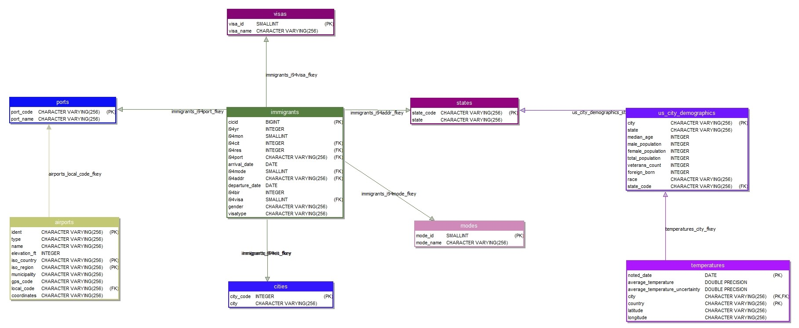

# Data Engineering Capstone Project

## Scope

The purpose of this project is to demonstrate various skiles associated to data engineering. There are four random datasets taken, by researching these datasets a conceptual data model is being created. Apacke Spark is being to read, Transform and Load the data into Redshift. While working with huge volumes of data spark processing speed is high and data manipulation and cleansing though data frames is very easy.

## Datasets
The following datasets are included in the project.
* **I94 Immigration Data**: This data comes from the US National Tourism and Trade Office. A data dictionary is included in the workspace. [This](https://travel.trade.gov/research/reports/i94/historical/2016.html) is where the data comes from. There's a sample file so you can take a look at the data in csv format before reading it all in. You do not have to use the entire dataset, just use what you need to accomplish the goal you set at the beginning of the project.
* **World Temperature Data**: This dataset came from Kaggle. You can read more about it [here](https://www.kaggle.com/berkeleyearth/climate-change-earth-surface-temperature-data).
* **U.S. City Demographic Data**: This data comes from OpenSoft. You can read more about it [here](https://public.opendatasoft.com/explore/dataset/us-cities-demographics/export/).
* **Airport Code Table**: This is a simple table of airport codes and corresponding cities. It comes from [here](https://datahub.io/core/airport-codes#data).

### Accessing the Data
Some of the data is already uploaded to this repository, which you'll see in the `Datasets` folder. The immigration data is in an attached disk.

* **Immigration Data** <br>
    You can access the immigration data in a folder by extracting the data.zip file. There's a file for each month of the year. An example file name is `i94_apr16_sub.sas7bdat`. Each file has a three-letter abbreviation for the month name. So a full file path for June would look like this: `../../data/18-83510-I94-Data-2016/i94_jun16_sub.sas7bdat` (Due to space constraint I have uploaded only one file by compressing it). Below is what it would look like to import this file into pandas. Note: these files are large, so you'll have to think about how to process and aggregate them efficiently.

    ```python
    fname = 'data/18-83510-I94-Data-2016/i94_apr16_sub.sas7bdat'
    df = pd.read_sas(fname, 'sas7bdat', encoding="ISO-8859-1")
    ```

    `immigration_data_sample.csv` contains sample data present in the i94_apr16_sub.sas7bdat for the reference.

* **Temperature Data** - `GlobalLandTemperaturesByCity.csv` file.
* **U.S. City Demographic Data** - `us-cities-demographics.csv` file.
* **I94 SAS Labels Descriptions** - `I94_SAS_Labels_Descriptions.SAS` file contains the descriptions to labels of `sas7bat` files

##  Relational Data Model
Following is the Relational model that can be formed by exploring the above datasets




The data Dictionary is provided in a separate file - `DataDictionary.md`

## Configuration and Script Files used in this project

**1. `cloud.cfg`** - Configuration file with the Redshift cluster, database and S3 bucket details.
**2. `CreateTables.py`** - Script to create schema tables in the Redshift. <br>
**3. `sql_queries.py`** - Script with DROP TABLE, CREATE TABLE statements of the database tables.This is invoked in `CreateTables.py`.<br>
**4. `LabelDescriptorToJson.py`** - <br>
    Script that takes the _`I94_SAS_Label_Descriptors.SAS`_ and creates a **nested** json file - `I94_SAS_Label_Descriptors.json`. <br>
    Following is the JSON file structure created by script
```json
{
 {
      "I94CIT_I94RES" : [{"key": "102", "val": "ANDORRA"}, {"key": "324", "val": "ANGOLA"}, ......]
    },
    {
      "I94PORT": [{"key": "ALC", "val": "ALCAN, AK"}, {"key": "ANC", "val": "ANCHORAGE, AK"},... ]
    },
    {
      "I94MODE": [{"key": "1", "val": "Air"}, {"key": "2", "val": "Sea"}, {"key": "3", "val": "Land"}, {"key": "9", "val": "Not reported"}]
    }
    {
      "I94VISA": [{"key": "1", "val": "Business"}, {"key": "2", "val": "Pleasure"},...]
    }
}
```
**4. `LoadingDataFilesToS3.py`** - Script to load all datafiles onto S3 bucket. This script also invokes `LabelDescriptorToJson.py` uploads nested JSON file to S3. <br>
**5. `ETL2Redshift.py`** - Processes and loads the data into Redshift tables.<br>
**6. `Capstone Project.ipynb`** - Notebook elaborating ETL steps used in the above scripts for simple understanding.

## Prerequisites
* Scala v2.11
* Python v3.6
* [postgresql-42.2.6.jar](https://repo1.maven.org/maven2/org/postgresql/postgresql/42.2.6/postgresql-42.2.6.jar) - This JAR is also available in the `Jars/` folder

***Note:*** `saurfang:spark-sas7bdat:2.1.0-s_2.11` supports Scala version 2.11 for now check [here](https://spark-packages.org/package/saurfang/spark-sas7bdat)<br>
  - [Maven Repository Link](https://mvnrepository.com/artifact/saurfang/spark-sas7bdat/2.1.0-s_2.11) for `saurfang:spark-sas7bdat`
  - [Here](https://libraries.io/github/saurfang/spark-sas7bdat) is some reference for working with sas7bat files.
